# Fashion Market

Fashion Market is a mobile application built using the Flutter framework. This app provides a seamless shopping experience for users, allowing them to browse through various fashion categories, view detailed product information, and manage their favorite items. The app utilizes the Cubit and MVVM patterns along with Firebase Authentication for user management.

## Features

### Home Screen
- Displays two main sections: 
  - **Products on Sale**: Highlighting items with current discounts.
  - **New Arrivals**: Showcasing the latest products in the market.

### Menu Screen
- Categories include:
  - New Arrivals
  - Clothes
  - Bags
  - Shoes
  - Watches
- Users can select any category to view relevant products.
- Option to add any product to the Favorites screen for easy access later.

### Product Information
- Detailed view of individual products including:
  - Name
  - Description
  - Price
  - Other relevant details
- Users can add, update, and delete products.

### Profile Page
- Displays user information including:
  - Name
  - Role (Seller or Buyer)

## Technologies Used
- **Flutter**: For building the cross-platform mobile application.
- **Cubit**: For state management.
- **MVVM Pattern**: For separating business logic from UI code.
- **Firebase Authentication**: For managing user sign-in and authentication.

## Screenshots
<div style="display: flex; flex-wrap: wrap;">
    <div style="margin: 10px;">
        <p>Auth Screen</p>
        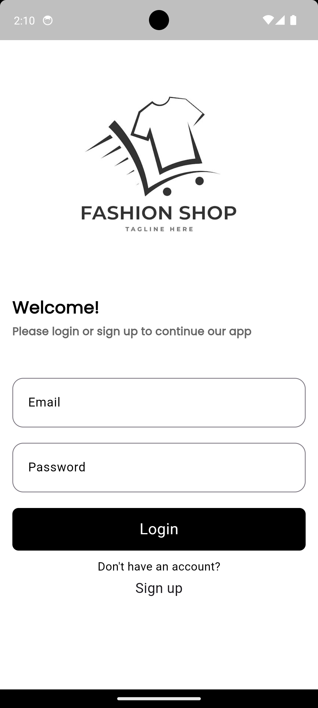
        
        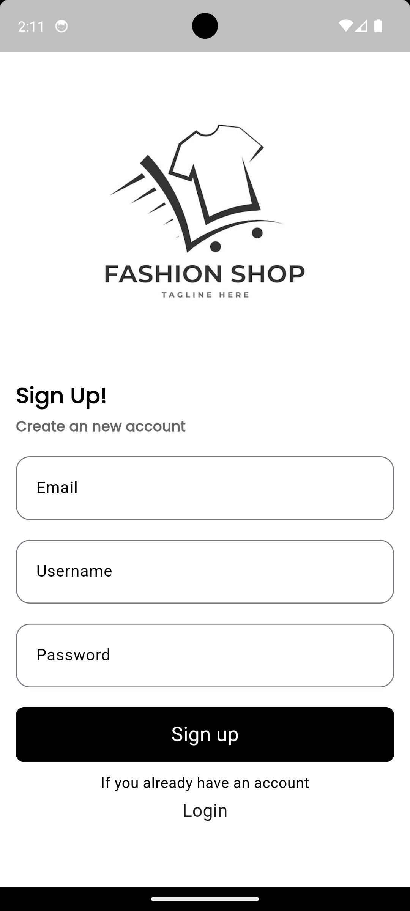
    </div>
    <div style="margin: 10px;">
       <p>Home Page Screen</p>
        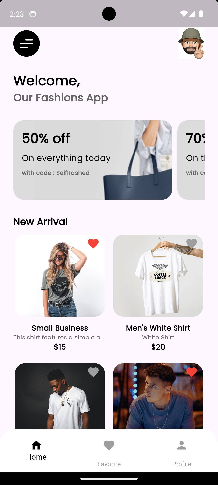
        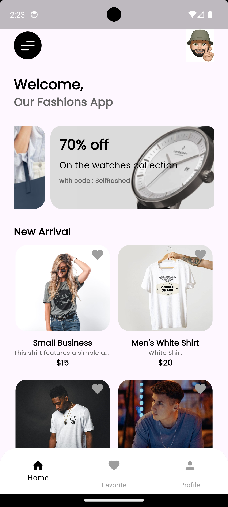
    </div>
   <div style="margin: 10px;">
       <p>Profile Screen</p>
        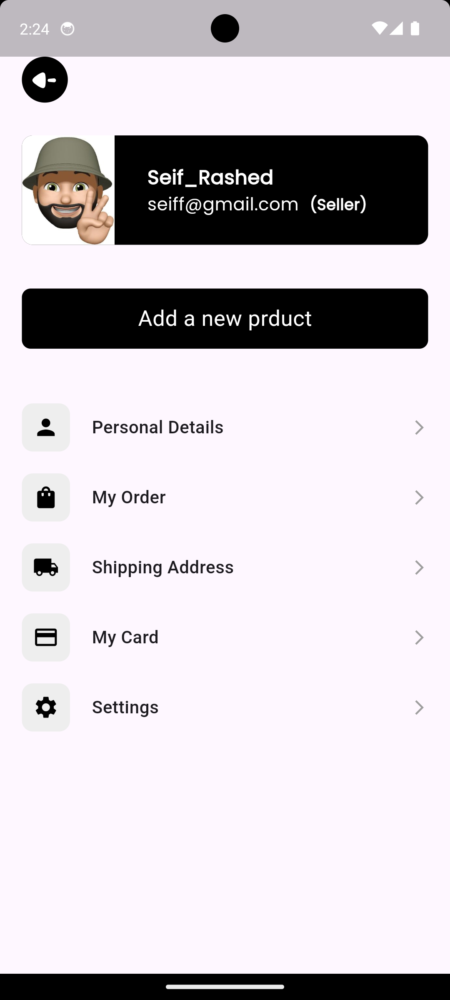
        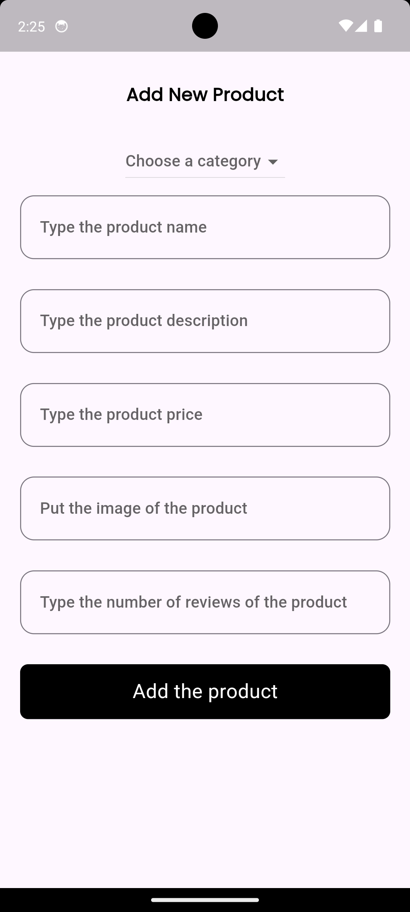
        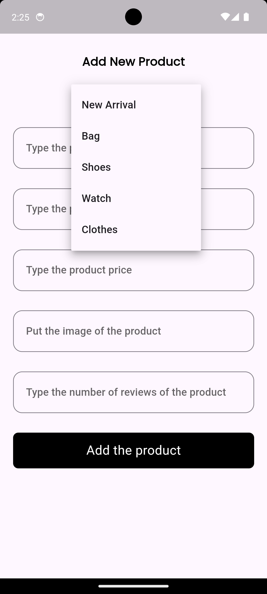
    </div>
  <div style="margin: 10px;">
       <p>Favourite Page </p>
        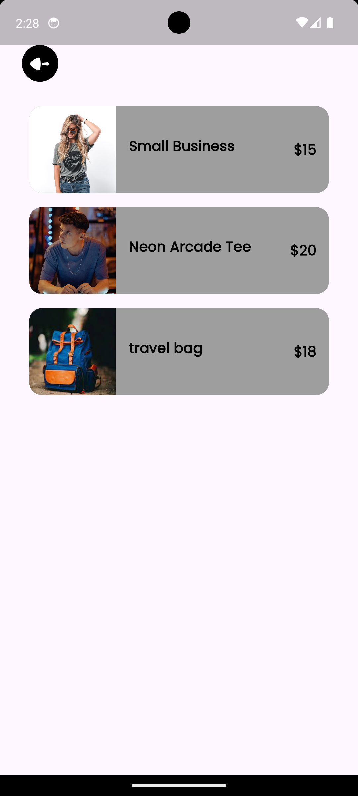
    </div>
     <div style="margin: 10px;">
       <p>Menu Screen</p>
        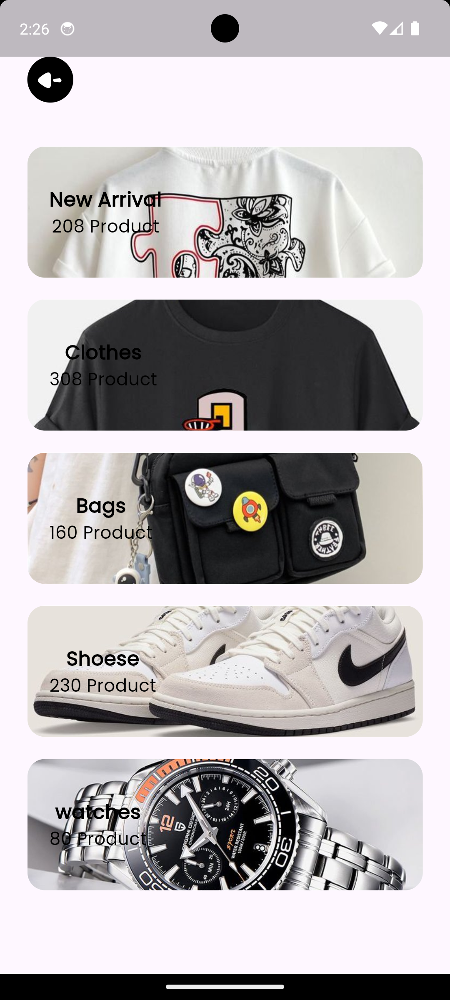
        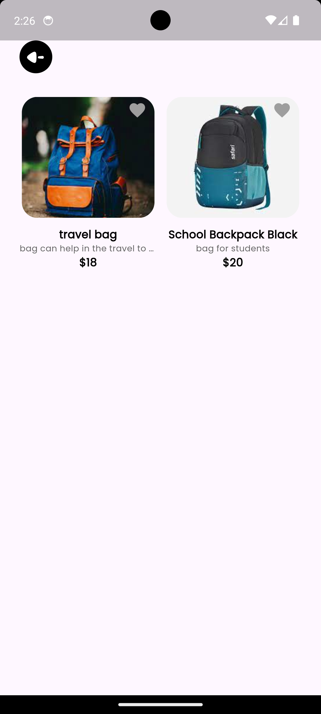
        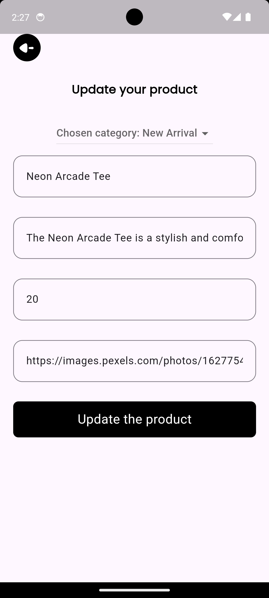
    </div>
</div>

## Getting Started
To get a local copy up and running, follow these simple steps:

1. **Clone the repository**
    ```bash
    git clone https://github.com/yourusername/fashion-market.git
    ```

2. **Install Flutter dependencies**
    ```bash
    flutter pub get
    ```

3. **Run the app**
    ```bash
    flutter run
    ```

## Contributing
Contributions are what make the open-source community such an amazing place to learn, inspire, and create. Any contributions you make are **greatly appreciated**.

1. Fork the Project
2. Create your Feature Branch (`git checkout -b feature/AmazingFeature`)
3. Commit your Changes (`git commit -m 'Add some AmazingFeature'`)
4. Push to the Branch (`git push origin feature/AmazingFeature`)
5. Open a Pull Request

## License
Distributed under the MIT License. See `LICENSE` for more information.

## Contact
Seif Mohamed Rashed - [seifrashedswe@gmail.com](mailto:seifmohamed@example.com)
